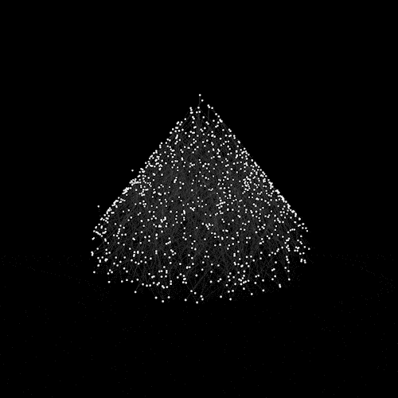

 
<!--ARTISTA VISUAL | DESARROLLADORA FULL STACK | DISEÑADORA 3D-->

<!--  -->

## <picture></picture> About me

<h3>hello world! I'm Yese Astarloa</h3>

<!-- ##  &nbsp;hello world! Soy Yese Astarloa -->

<!-- ### 👨🏻‍💻 &nbsp;About Me -->

💡 &nbsp;I like to explore new technologies and develop software solutions and quick hacks.\
<!--🎓 &nbsp;I'm currently studying Computer Science and Mathematics at the University of Massachusetts Amherst.\-->
<!--🌱 &nbsp;I'm on track for learning more about Artificial Intelligence, Systems Design, and Cloud Architecture.\-->
✍️ &nbsp;I work like a visual artist and a 3d designer.\
💬 &nbsp;Feel free to reach out to me for pro bono consulting and volunteering, or just for some interesting discussion.\
✉️ &nbsp;You can shoot me an email at yese.astarloa@gmail.com! I'll try to respond as soon as I can.\
<!--📄 &nbsp;Please have a look at my [Résumé](https://www.adityavsingh.com/resume.html) for more details about me. I'm open to feedback and suggestions!-->

<!---->

<!--  -->

<!--  -->

 
 

### 🛠 &nbsp;Tech Stack

<!-- ## 🛠️ My Skills -->

<!--&nbsp;-->
&nbsp;
<!--&nbsp;-->
<!--&nbsp;-->
<!--&nbsp;-->
<!--\-->
&nbsp;
&nbsp;
<!--&nbsp;-->
<!--&nbsp;-->
<!--\-->
&nbsp;
&nbsp;
&nbsp;
&nbsp;

\
&nbsp;

<!--&nbsp;-->
<!--\-->

&nbsp;

&nbsp;

<!--### ⚙️ &nbsp;GitHub Analytics

<!--

-->

 
 

<!-- ### 🤝🏻 &nbsp;Connect with Me -->

## <picture>  </picture> Connect with me

<!-- <h1 align="center">Hi , I'm Ahmed Hossam </h1>

  

 -->

<!-- 
 
	 
	-
		
	

 -->

	

<!-- <picture> </picture> -->

 
 

## <picture>   </picture> Github Stats

 
 

<picture>   </picture>

 
 
 

<!-- ### <picture>   </picture> Programming languages

### <picture>   </picture> Frontend Development

 ### <picture>   </picture> IDEs
 

 ### <picture>   </picture> Competitive Programming & Problem Solving
 

 ### <picture>   </picture> Operating Systems -->

